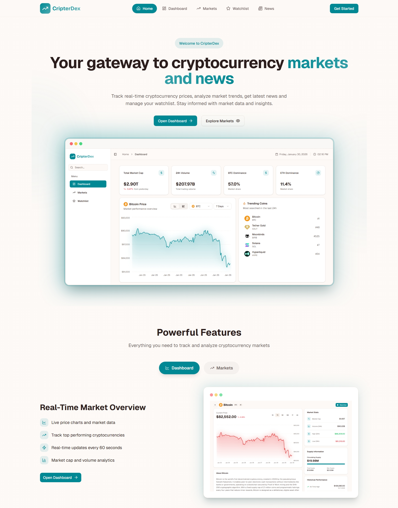

# 🪙 CripterDex: Your Crypto Command Center

[](https://cripterdex.vercel.app/)

> **CripterDex** is a sleek, lightning-fast cryptocurrency dashboard that puts the power of blockchain markets in your hands. Whether you're a seasoned trader watching every tick or a curious investor keeping tabs on Bitcoin, this is your command center.

Built with cutting-edge web technologies and designed to feel snappy, responsive, and intuitive—CripterDex transforms complex crypto data into actionable insights.



---

## 🚀 What You Can Do With CripterDex

- **🔄 Real-Time Market Pulse**: Track thousands of cryptocurrencies as they move. Data refreshes every 60 seconds, keeping you in sync with the market.
- **📈 Interactive Charts**: Dive into price history with beautiful, responsive charts. Zoom into 1-day moves or zoom out to see 1-year trends.
- **📰 Crypto News Feed**: Stay informed with a curated feed of the latest crypto news, powered by industry-leading sources.
- **⭐ Custom Watchlist**: Build your own portfolio and watch your favorite coins in one place. Data persists across sessions.
- **🎯 Market Intelligence**:
  - See which coins are pumping (Top Gainers) and which are dumping (Top Losers)
  - Discover trending coins before the crowd
  - Analyze market cap and trading volume at a glance
- **📱 Works Everywhere**: Desktop, tablet, phone—everything adapts beautifully.
- **📦 Install as App**: PWA support means you can install CripterDex like a native app on your phone or computer.

---

## 🏗️ System Architecture

Here's how CripterDex orchestrates real-time crypto data:

```
┌─────────────────────────────────────────────────────────────────┐
│                        CripterDex - Data Flow                   │
└─────────────────────────────────────────────────────────────────┘

┌──────────────────┐
│   User Browser   │ (Next.js Frontend App)
│  - Dashboard     │
│  - Markets       │
│  - Watchlist     │
│  - News Feed     │
└────────┬─────────┘
         │
         │ HTTP Requests
         ▼
┌──────────────────────────────────────────┐
│   Next.js API Routes (Internal)          │
│                                          │
│  /api/crypto/list    ──┐                │
│  /api/crypto/chart   ──┼─► Data Layer  │
│  /api/crypto/trending ─┤  (Caching &   │
│  /api/crypto/global  ──┤   Fallback)  │
│  /api/crypto/search  ──┤               │
│  /api/crypto/news    ──┘               │
└────────┬─────────────────────────────────┘
         │
         │ Fetch Requests
         ├──────────────────────────┬──────────────────────┐
         ▼                          ▼                      ▼
    ┌────────────┐           ┌─────────────┐      ┌──────────────┐
    │ CoinGecko  │           │CryptoCompare│      │  Mock Data   │
    │   API      │           │    API      │      │ (Fallback)   │
    │            │           │             │      │              │
    │ • Markets  │           │ • News Feed │      │ Only used    │
    │ • Charts   │           │             │      │ if APIs down │
    │ • Trending │           │             │      │              │
    │ • Global   │           │             │      │              │
    └────────────┘           └─────────────┘      └──────────────┘
         │                          │                    ▲
         └──────────────┬───────────┘                    │
                        │                                │
                    Cached Response                    Rate Limited?
                    (5 min TTL)                        Use Fallback
```

---

## 🔌 External Integrations

| Service | Purpose | What It Provides |
|---------|---------|-----------------|
| **[CoinGecko API](https://www.coingecko.com/en/api)** | Market Data Source | Live prices, market caps, charts, trending coins |
| **[CryptoCompare API](https://min-api.cryptocompare.com/)** | News Aggregator | Latest crypto news from top sources |
| **[Lenis](https://github.com/darkroomengineering/lenis)** | Smooth Scrolling | Buttery smooth, physics-based scroll interactions |
| **[Framer Motion](https://www.framer.com/motion/)** | Animations | Performant, GPU-accelerated UI animations |
| **[Vercel Analytics](https://vercel.com/analytics)** | Analytics | Privacy-friendly traffic insights |

---

## ⚡ How It _Actually_ Works (Performance Deep Dive)

### Server-Side Rendering (SSR)
When you visit CripterDex, the first page load happens on our servers. This means:
- ✅ Market data is already there when your browser loads the page
- ✅ Faster First Contentful Paint (FCP)
- ✅ Better for search engines (SEO)

### Smart Caching Strategy
We cache API responses for **5 minutes**:
- External APIs have rate limits—we respect those
- Cache prevents hammering external services
- Automatic revalidation keeps data reasonably fresh
- Fallback to mock data if APIs are down (graceful degradation)

### Optimized Data Fetching
- Charts load separately from metadata (no spinners for the whole page)
- Avoids "Cumulative Layout Shift" (CLS)—content doesn't jump around
- Each section shows a skeleton loader while data arrives

### Code Splitting & Lazy Loading
- Heavy charting libraries only load when needed
- Recharts and other big dependencies are split across route bundles
- App Router handles this automatically

---

## 🛠️ Tech Stack Breakdown

| Layer | Technology | Why We Use It |
|-------|-----------|--------------|
| **Framework** | [Next.js 16](https://nextjs.org/) (App Router) | Fast, modern, great for SSR and APIs |
| **Language** | [TypeScript](https://www.typescriptlang.org/) | Catch bugs early, better IDE support |
| **Styling** | [Tailwind CSS](https://tailwindcss.com/) | Rapid UI development, consistent design |
| **Components** | [shadcn/ui](https://ui.shadcn.com/) (Radix) | Pre-built, accessible, copy-paste ready |
| **Charts** | [Recharts](https://recharts.org/) | React-native, responsive, beautiful |
| **Animations** | [Framer Motion](https://www.framer.com/motion/) | Simple API, powerful effects |
| **State** | [Zustand](https://github.com/pmndrs/zustand) | Lightweight, minimal boilerplate |
| **Forms** | [React Hook Form](https://react-hook-form.com/) | Performant, flexible validation |

---

## 📁 Project Structure Guide

```
CripterDex/
├── app/                    # Next.js App Router
│   ├── api/crypto/        # Internal API routes
│   │   ├── list/          # GET paginated crypto list
│   │   ├── chart/[id]/    # GET price history for coin
│   │   ├── coin/[id]/     # GET detailed coin info
│   │   ├── trending/      # GET trending coins
│   │   ├── global/        # GET global market stats
│   │   ├── search/        # GET search results
│   │   └── news/          # GET crypto news feed
│   ├── dashboard/         # Main dashboard page
│   ├── markets/           # Market overview page
│   ├── watchlist/         # User's custom watchlist
│   ├── coin/[id]/         # Detailed coin page
│   ├── news/              # Full news feed
│   ├── analytics/         # Analytics dashboard
│   ├── preview/           # Template previews
│   ├── links/             # Links page
│   └── layout.tsx         # Root layout
├── components/
│   ├── ui/                # Reusable shadcn/ui components
│   ├── app-header.tsx     # Top navigation
│   ├── app-sidebar.tsx    # Left sidebar
│   ├── layout-shell.tsx   # Layout wrapper
│   └── ...
├── hooks/
│   ├── use-watchlist-store.tsx  # Zustand watchlist state
│   ├── use-links-store.tsx      # Custom links state
│   └── use-mobile.ts            # Mobile detection
├── lib/
│   ├── crypto-api.ts      # API client functions
│   ├── types.ts           # TypeScript interfaces
│   ├── utils.ts           # Helper utilities
│   └── mock-data.ts       # Fallback data
└── public/
    ├── manifest.json      # PWA manifest
    ├── sw.js              # Service worker
    └── offline.html       # Offline fallback
```

---

## 🚀 Getting Started

### Prerequisites
- **Node.js**: 18.17+ (or higher)
- **pnpm**: 10.24.0+ (package manager)

### Installation & Setup

1. **Clone or download the project**
   ```bash
   git clone <repository-url>
   cd CripterDex
   ```

2. **Install dependencies**
   ```bash
   pnpm install
   ```

3. **Run the development server**
   ```bash
   pnpm dev
   ```
   Open [http://localhost:3000](http://localhost:3000) in your browser.

4. **Build for production**
   ```bash
   pnpm build
   pnpm start
   ```

---

## 🎨 Customization Guide

### Add a New Feature Page

1. Create a new folder under `app/`: `app/my-feature/`
2. Add `page.tsx` inside it
3. Use the `layout-shell.tsx` wrapper for consistent styling
4. Add navigation link in `components/app-sidebar.tsx`

### Create a New API Endpoint

1. Create `app/api/crypto/my-endpoint/route.ts`
2. Export `GET`, `POST`, etc. handlers
3. Use the caching pattern from existing routes:
   ```typescript
   export const revalidate = 300 // 5 minutes
   ```
4. Call it from your components with `fetch('/api/crypto/my-endpoint')`

### Customize Watchlist Storage

The watchlist uses Zustand for state management. Edit [hooks/use-watchlist-store.tsx](hooks/use-watchlist-store.tsx) to change how data persists.

---

## 📊 API Reference

All requests go through the internal API layer at `/api/crypto/`

### Crypto List
```
GET /api/crypto/list?page=1&per_page=50&order=market_cap_desc
```
Returns paginated list of cryptocurrencies with market data.

### Coin Details
```
GET /api/crypto/coin/[id]
```
Returns detailed information for a specific coin.

### Price Chart
```
GET /api/crypto/chart/[id]?days=7
```
Returns price history (timestamps and values) for charts.

### Global Market Stats
```
GET /api/crypto/global
```
Returns overall market cap, volume, and dominance data.

### Trending Coins
```
GET /api/crypto/trending
```
Returns top trending coins from CoinGecko.

### Search
```
GET /api/crypto/search?query=bitcoin
```
Search for cryptocurrencies by name or symbol.

### News Feed
```
GET /api/crypto/news
```
Returns latest crypto news from top publishers.

---

## 🐛 Troubleshooting

| Issue | Solution |
|-------|----------|
| **API showing "No data available"** | CoinGecko rate limit hit. Data falls back to mock. Wait a few minutes. |
| **Charts not rendering** | Check browser console for errors. Ensure JavaScript is enabled. |
| **App feels slow on first load** | Normal behavior—SSR is fetching data from external APIs. Usually takes 1-2 seconds. |
| **Watchlist disappeared after refresh** | Check browser's localStorage is enabled. Clear cache if broken. |
| **Mobile layout looks off** | Try rotating device or zooming out slightly. Report as bug if persists. |

---

## 📱 PWA Installation

CripterDex is a Progressive Web App. Install it like a native app:

**Desktop (Chrome/Edge)**
- Click the install icon in the address bar
- Or: Menu → "Install CripterDex"

**Mobile (iOS/Android)**
- **Android**: Tap menu → "Install app"
- **iOS**: Tap share → "Add to Home Screen"

You can now use CripterDex offline (limited functionality) and it will work like a native app!

---

## 🤝 Contributing

We love contributions! Here's how to help:

1. Fork the repository
2. Create a feature branch: `git checkout -b feature/your-idea`
3. Make your changes and commit: `git commit -m "Add cool feature"`
4. Push to your fork: `git push origin feature/your-idea`
5. Open a Pull Request

**Code Style**:
- Use TypeScript—no untyped code
- Follow the existing folder structure
- Use Tailwind CSS for styling
- Keep components small and reusable

---

## 📄 License

This project is open source and available under the MIT License.

---

## 🎯 Roadmap

Future features in the works:
- 🔔 Price alerts and notifications
- 💾 Portfolio tracking with P&L calculations
- 🌐 Multi-language support
- 🔐 User authentication & cloud sync
- 📊 Advanced technical indicators

---

## 💬 Questions or Issues?

- 📧 Start a discussion in the repository
- 🐛 Report bugs with detailed steps to reproduce
- 💡 Suggest features in the issues tab

---

**Happy trading! 🚀**

